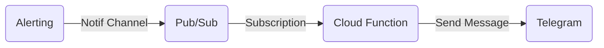

Sending gcp monitoring alerts to telegram



```console
gcloud functions deploy alert_notification \
--runtime=python37 --region=asia-southeast2 \
--trigger-topic=notification --entry-point=notification_pubsub
```